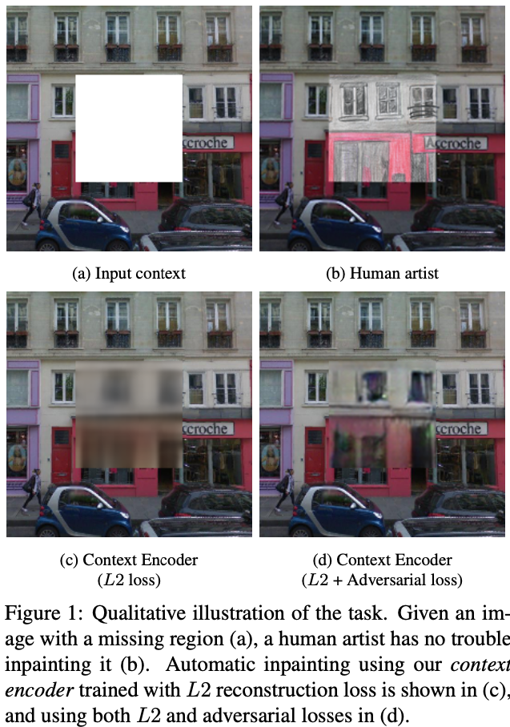
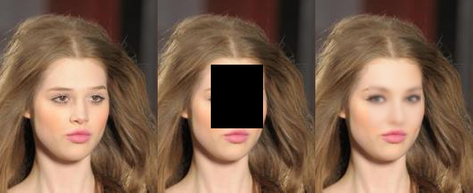
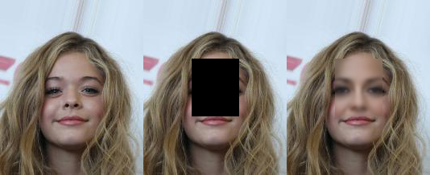

Context Encoders: Feature Learning by Inpainting
=====

TensorFlow implementation of "Context Encoders: Feature Learning by Inpainting" with CelebAMask-HQ Dataset.  

## Concept

    
  
The concept of 'Context Encoders' [1].

## Usage
### Training
In this repository, 'Context Encoders' is trained with 'CelebA' Dataset [2].  
The 'Context Encoders' consumes about 42 hours for training.  

### Test
The 'Context Encoders' consumes 0.029 seconds for each sample in inference.  

  
  
     
  
  
     
  
The results of 'Context Encoders' [1].

## Environment
* Python 3.7.4  
* Tensorflow 1.14.0  
* Numpy 1.17.1  
* Matplotlib 3.1.1  
* Scikit Learn (sklearn) 0.21.3  

## Reference
[1] Deepak Pathak, et al. (2016). <a href="https://arxiv.org/abs/1604.07379">Context Encoders: Feature Learning by Inpainting</a>. arXiv preprint arXiv:1604.07379.  
[2] CelebA. http://mmlab.ie.cuhk.edu.hk/projects/CelebA.html  
[3] CelebAMask-HQ Dataset. https://github.com/switchablenorms/CelebAMask-HQ  
